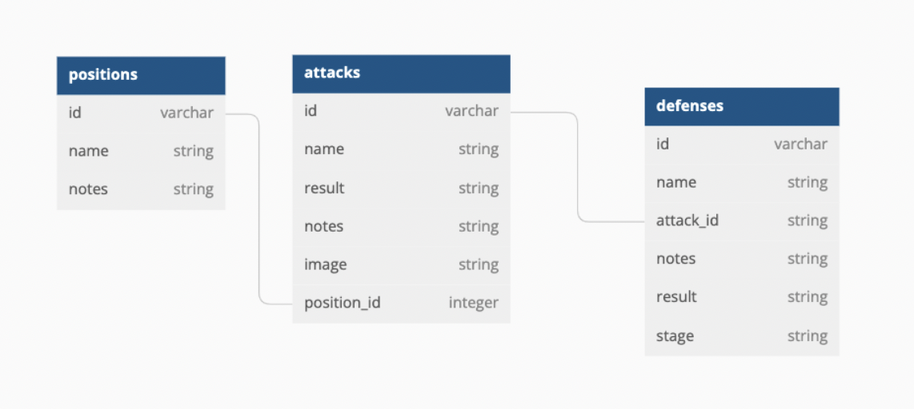

## Phase 3 Ruby Sinatra Project Server

## Overview

- This is a web basic API with Sinatra and Active Record to support a React frontend

## Introduction

The purpose of this backend is to record techniques used in the the martial art of Brazilian Jiu Jitsu. The idea is that this backend will engage with a frontend note taking application which can be used by Brazilian Jiu Jitsu students to keep track of and log what they are learning.

## Brazilian Jiu Jitsu Breakdown

For those who are completely unfamiliar with the art of Brazlilian Jiu Jitsu, here is a basic run-down: Brazilian Jiu Jitsu is a wrestling art. One fighter wins by placing the other in a position where they either have to "submit" or risk being rendered unconscious or sustaining some injury. When one fighter submits in this way it is known as "tapping out." Brazilian Jiu Jitsu places a very large emphasis on formalized techniques and positions. For example, the most famous position is the "closed guard" where one fighter has the other wrapped in their legs like this:


When in this position, each fighter has numerous "attacks" at their disposal. Consequently, the other fighter has numerous possible "defenses" for each attack.

## Database Structure

The Active Record Model here is linked to an SQL database with four distinct tables.

1. The positions table which has many attacks.
2. The attacks table which has many defenses.
3. The defenses table.
4. The "sequences" table.

The first three tables have a Database structure that looks like this:



./Images/Screen Shot 2022-07-20 at 11.25.01 AM.png


The last table is the "sequences" table and is used to log all possible combinations of the techniques in the other three tables. A sequence could be like the following: "Start from closed guard (position), then attack with the triangle choke (attack) and have your opponent defend by hiding his arm behind your leg(defense)."

This final table

## Requirements

For this project, you must:

- Use Active Record to interact with a database.
- Have at least two models with a one-to-many relationship.
- At a minimum, set up the following API routes in Sinatra:
  - create and read actions for both models
  - full CRUD capability for one of the models
- Build a separate React frontend application that interacts with the API to
  perform CRUD actions.
- Use good OO design patterns. You should have separate classes for each of your
  models, and create instance and class methods as necessary.

For example, build a todo list application with a React frontend interface and a
Sinatra backend API, where a user can:

- **Create** a new todo
- **Read** a list of all todos
- **Update** an individual todo
- **Delete** a todo

A `Todo` can be tagged with a `Category`, so that each todo _belongs to_ a
category and each category _has many_ todos.

## Getting Started

### Backend Setup

This repository has all the starter code needed to get a Sinatra backend up and
running. [**Fork and clone**][fork link] this repository to get started. Then, run
`bundle install` to install the gems.

[fork link]: https://github.com/learn-co-curriculum/phase-3-sinatra-react-project/fork

The `app/controllers/application_controller.rb` file has an example GET route
handler. Replace this route with routes for your project.

You can start your server with:

```console
$ bundle exec rake server
```

This will run your server on port
[http://localhost:9292](http://localhost:9292).

### Frontend Setup

Your backend and your frontend should be in **two different repositories**.

Create a new repository in a **separate folder** with a React app for your
frontend. To do this, `cd` out of the backend project directory, and use
[create-react-app][] to generate the necessary code for your React frontend:

```console
$ npx create-react-app my-app-frontend
```

After creating the project locally, you should also
[create a repository on GitHub][create repo] to host your repo and help
collaborate, if you're working with a partner.

### Fetch Example

Your React app should make fetch requests to your Sinatra backend! Here's an
example:

```js
fetch("http://localhost:9292/test")
  .then((r) => r.json())
  .then((data) => console.log(data));
```

## Project Tips

- This project is intended to focus more on the backend than the frontend, so
  try and keep the React side of things relatively simple. Focus on working with
  Active Record and performing CRUD actions. What are some interesting queries you can write? What kinds of questions can you ask of your data?
- Once you have a project idea, come up with a domain model and decide what
  relationships exist between the models in your application. Use a tool like
  [dbdiagram.io][] to help visualize your models.
- Decide on your API endpoints. What data should they return? What kind of CRUD
  action should they perform? What data do they need from the client?
- Use [Postman][postman download] to test your endpoints.
- Use `binding.pry` to debug your requests on the server. It's very helpful to use a
  `binding.pry` in your controller within a route to see what `params` are being
  sent.
- Use the [Network Tab in the Dev Tools][network tab] in the frontend to debug
  your requests.

## Resources

- [create-react-app][]
- [dbdiagram.io][]
- [Postman][postman download]

[create-react-app]: https://create-react-app.dev/docs/getting-started
[create repo]: https://docs.github.com/en/get-started/quickstart/create-a-repo
[dbdiagram.io]: https://dbdiagram.io/
[postman download]: https://www.postman.com/downloads/
[network tab]: https://developer.chrome.com/docs/devtools/network/
