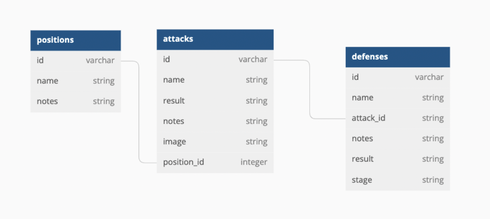
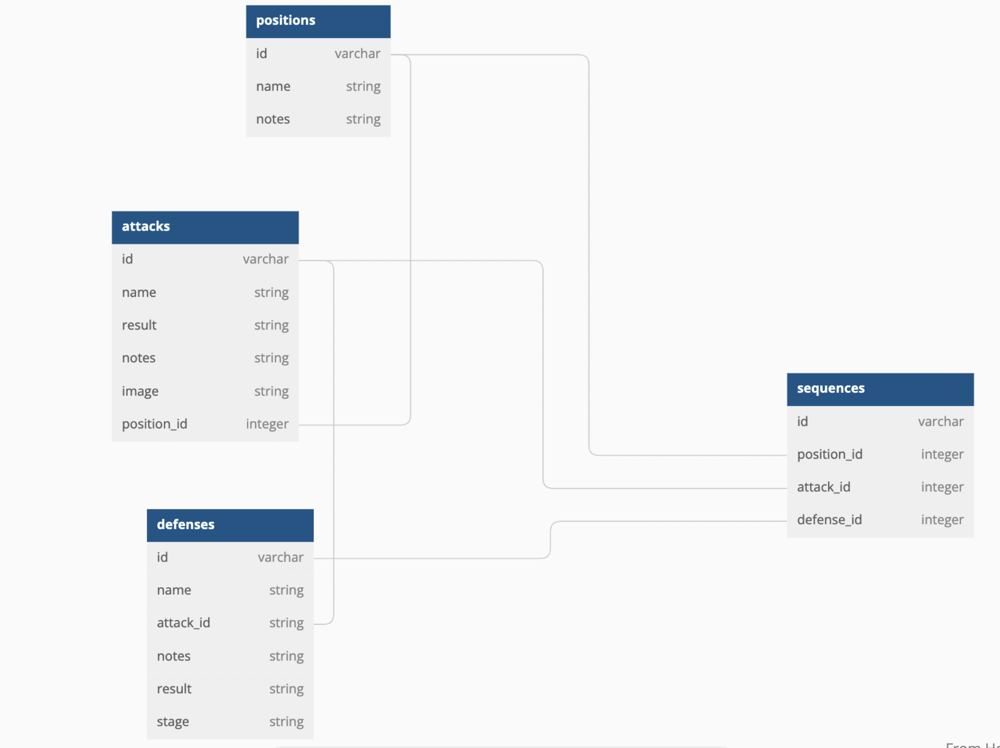

## Phase 3 Ruby Sinatra Project Server

## Overview

- This is a web basic API with Sinatra and Active Record to support a React frontend

## Introduction

The purpose of this backend is to record techniques used in the the martial art of Brazilian Jiu Jitsu. The idea is that this backend will engage with a frontend note taking application which can be used by Brazilian Jiu Jitsu students to keep track of and log what they are learning.

## Brazilian Jiu Jitsu Breakdown

For those who are completely unfamiliar with the art of Brazlilian Jiu Jitsu, here is a basic run-down: Brazilian Jiu Jitsu is a wrestling art. One fighter wins by placing the other in a position where they either have to "submit" or risk being rendered unconscious or sustaining some injury. When one fighter submits in this way it is known as "tapping out." Brazilian Jiu Jitsu places a very large emphasis on formalized techniques and positions. For example, the most famous position is the "closed guard" where one fighter has the other wrapped in their legs like this:


When in this position, each fighter has numerous "attacks" at their disposal. Consequently, the other fighter has numerous possible "defenses" for each attack.

## Database Structure

The Active Record Model here is linked to an SQL database with four distinct tables.

1. The positions table which has many attacks.
2. The attacks table which has many defenses.
3. The defenses table.
4. The "sequences" table.

The first three tables have a Database structure that looks like this:



## The Sequence Table

The last table is the "sequences" table and is used to log all possible combinations of the techniques in the other three tables. A sequence could be like the following: "Start from closed guard (position), then attack with the triangle choke (attack) and have your opponent defend by hiding his arm behind your leg(defense)." In this way, the sequence table actually has a one-to-many relationship with each of the three other tables:



The above tables were created using [dbdiagram.io][]

Unlike the other tables in this database, you don't actually make any POST or PATCH or DELETE requests to this table. It is set up with a class method `Sequence.generate` that populates the sequence table with all possible permutations of the data existing in the other three tables. Consequently, anytime a Post Request is sent to the "/defenses" route, the program fires `Sequence.generate` updating this table.

## Sinatra Routes

Users can make requests to the following routes:

```ruby
get "/defenses"

get "/defenses/:id"

post "/defenses"
use the following format in body:
{"name": string,
"result": string,
"notes": string,
"attack_id": integer,
"stage": string}

patch "/defenses/:id"

delete "/defenses/:id"

get "/attacks"

get "/attacks/:id"

post "/attacks"
use the following format in body:
{"name": string, "result": string, "notes": string}

patch "/attacks/:id"

delete "/attacks/:id"

get "/positions"
get "/positions/:id"

post "/positions"
use the following format in body:
{"name": string, "notes": string}

patch "/positions/:id"

delete "/positions/:id"

#You can get only those attacks associated with a particular position, thus reducing client burden

get "/positions/:id/attacks"

#You can get only those defenses associated with a particular attack, thus reducing client burden
get "/attacks/:id/defenses"

get "/sequences"
# this provides a list of all possible sequences in narrative form
```

## Getting Started

### Backend Setup

**Fork and clone** from

```
git@github.com:JPStupfel/phase-3-sinatra-react-project-server.git

```

to get started with the backend side of the project.

Then, run `bundle install` to install the gems.

You can start your server with:

```console
$ bundle exec rake server
```

This will run your server on port
[http://localhost:9292](http://localhost:9292).

### Frontend Setup

The backend and the frontend for this project are in **two different repositories**.

**Fork and clone** from

```
git@github.com:JPStupfel/-phase-3-sinatra-react-project-client.git
```

to get started with the Front End. Then, run
`npm install`.

### Fetch Example

The React app should make fetch requests to the Sinatra backend using this format:

```js
fetch("http://localhost:9292/attacks")
  .then((r) => r.json())
  .then((data) => console.log(data));
```

## Project Video Walkthrough


